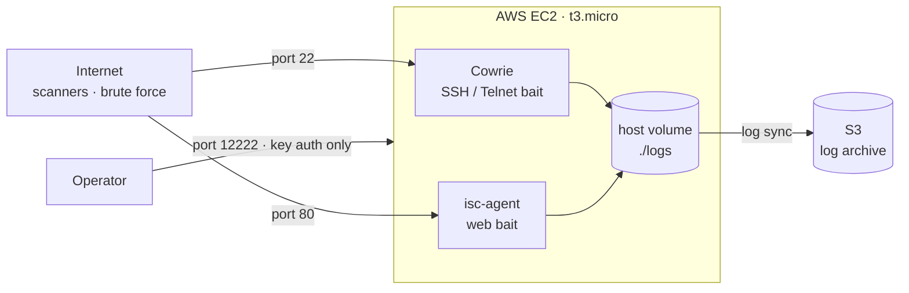
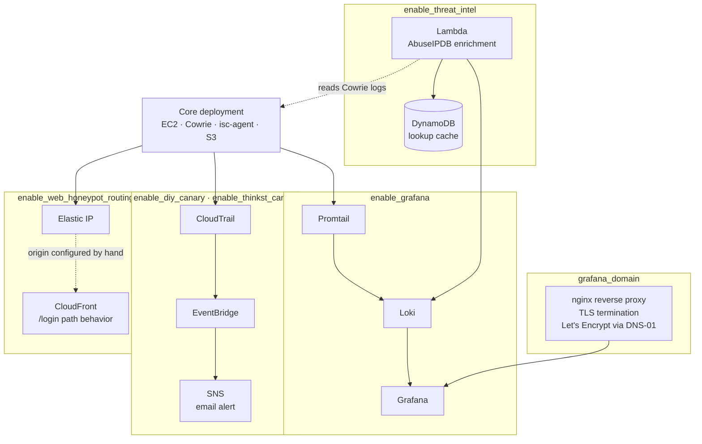

# terrapot

A honeypot and threat-intelligence sensor defined entirely in Terraform. Clone the repo, supply your own values, `terraform apply`, and you get a working sensor in your own AWS account: SSH and web bait exposed to the internet, logs archived to S3, with optional dashboarding, threat-intel enrichment, and a deception layer.

It's built to provide a practical subset of commercial SIEM capability at infrastructure cost, using open-source tooling instead of per-GB licensing.

**Components:**

- An SSH/Telnet honeypot ([Cowrie](https://github.com/cowrie/cowrie)) capturing brute-force attempts and post-authentication attacker behavior
- A web honeypot ([DShield `isc-agent`](https://github.com/DShield-ISC/dshield)) capturing credential stuffing, exploit attempts, and automated scanning
- Canary tokens and a decoy IAM user, wired through CloudTrail and EventBridge, alerting on unauthorized AWS API calls
- Grafana dashboards fed by Loki
- A GitHub Actions pipeline running `terraform fmt`, `validate`, and Checkov against every change before merge

> **Built with AI assistance.** I designed, debugged, and operated this. Every architectural decision, every troubleshooting session, every line typed and verified was mine. Claude (Anthropic) was a collaborator throughout: proposing diagnostic steps, explaining AWS and Terraform mechanics, and catching my mistakes. I caught several of its own, including one where it told me to point a DNS record at a Terraform output that goes stale the instant an Elastic IP attaches. I'm stating this plainly because it's how the project was actually built.

---

## Why this exists

Most residential ISP accounts filter inbound traffic on ports 80 and 443. If you're running a web honeypot at home, it will never see a request, and no amount of configuration will change that. I hit exactly this with a DShield sensor on a Raspberry Pi: the Cowrie side worked, the web side logged nothing.

That leaves two options. Buy a business account, or move the infrastructure to the cloud.

I chose infrastructure-as-code in the cloud, which also made it worth building the rest of what a sensor should have rather than just relocating the containers.

The project doubles as a learning platform. Each component exists to work through a real production pattern rather than to check a box: TLS termination at the edge, DNS-01 ACME validation, IAM least-privilege, and static analysis gating a merge.

---

## Architecture

### Default deployment

A plain `terraform apply` with no optional variables set produces this. Two honeypot containers on a single instance, logs archived to S3, admin access on a non-standard port.



### What the toggles add

Everything past the core is opt-in through a variable and off by default. Each block below turns on independently.



The dashed line on the CloudFront block is deliberate. That origin is configured by hand, outside this repo's Terraform state, for reasons covered under [What's deliberately manual](#whats-deliberately-manual).

---

## Deploying it

### Prerequisites

An AWS account with credentials configured, Terraform installed, an SSH keypair you control, and a globally unique S3 bucket name. For DShield reporting, register a free account at [isc.sans.edu](https://isc.sans.edu) and retrieve your user ID and API key.

### Quick start

```bash
git clone https://github.com/therossfisher/terrapot.git
cd terrapot
cp terraform.tfvars.example terraform.tfvars
# populate terraform.tfvars, see the tables below
terraform init
terraform plan
terraform apply
```

### Required variables

These have no defaults. Terraform will refuse to plan without them, which is deliberate. An earlier version defaulted them to empty strings, so a missing value passed validation, flowed through `templatefile()` into the container, and failed at runtime as a `ValueError` in `agent.py` inside a ten-second retry loop. `docker ps` reported the container as healthy throughout. Failing at plan time is the correct behavior.

| Variable | Purpose |
|---|---|
| `public_key_path` | Path to your public key, installed on the instance for admin SSH |
| `bucket_name` | Globally unique S3 bucket for log archival |
| `dshield_userid` | SANS ISC user ID |
| `dshield_authkey` | SANS ISC API key |
| `grafana_admin_password` | Grafana falls back to `admin`/`admin` if this is unset |

### Optional variables

| Variable | Default | Effect |
|---|---|---|
| `aws_region` | `us-east-1` | Deployment region |
| `instance_type` | `t3.micro` | EC2 instance size |
| `admin_ssh_port` | `12222` | Admin SSH port. Port 22 belongs to Cowrie |
| `grafana_port` | `3000` | Grafana's direct port when no domain is configured |
| `enable_dshield` | `false` | Reports Cowrie sessions upstream to SANS ISC |
| `enable_grafana` | `false` | Brings up Grafana, Loki, and Promtail via a Docker Compose profile |
| `grafana_domain` | `""` | Provisions HTTPS through Let's Encrypt using DNS-01. Requires a Route53 zone you control |
| `route53_hosted_zone_id` | `""` | Required when `grafana_domain` is set |
| `letsencrypt_email` | `""` | Required when `grafana_domain` is set |
| `grafana_admin_user` | `admin` | Grafana admin username |
| `enable_web_honeypot_routing` | `false` | Allocates a stable Elastic IP for CloudFront path routing |
| `enable_diy_canary` | `false` | Decoy IAM user with CloudTrail, EventBridge, and SNS alerting |
| `canary_alert_email` | `""` | Destination for DIY canary alerts. Requires confirming an SNS subscription email |
| `enable_thinkst_canary` | `false` | Plants a Canarytokens.org AWS key pair in the Cowrie filesystem |
| `thinkst_canary_access_key_id` | `""` | From canarytokens.org |
| `thinkst_canary_secret_access_key` | `""` | From canarytokens.org |
| `enable_threat_intel` | `false` | AbuseIPDB enrichment Lambda with DynamoDB cache |
| `abuseipdb_api_key` | `""` | Required when `enable_threat_intel` is true |
| `exclude_ip` | `""` | Your own IP, filtered out of every dashboard panel so testing traffic doesn't pollute the data |

Full annotations are in `terraform.tfvars.example`.

### Ports

| Port | Service | Notes |
|---|---|---|
| `22` | Cowrie SSH bait | **Not the admin port.** Connecting here places you inside the honeypot |
| `80` | isc-agent web bait | Also reachable through CloudFront path routing when enabled |
| `443` | Grafana behind nginx | Only when `grafana_domain` is set. TLS terminates at nginx, plaintext internally |
| `3000` | Grafana, direct | Only when `enable_grafana` is on without a domain. Configurable via `grafana_port` |
| `12222` | Admin SSH | Key-based auth only, no password login. Configurable via `admin_ssh_port` |

Admin SSH is displaced off port 22 because Cowrie occupies it:

```bash
ssh -i ~/.ssh/<your-key> -p 12222 ubuntu@<instance-ip>
```

Retrieve the current IP from the AWS CLI rather than a Terraform output. Once an Elastic IP attaches, `terraform output instance_public_ip` goes stale mid-apply:

```bash
aws ec2 describe-instances --filters "Name=tag:Name,Values=terrapot" \
  --query "Reservations[].Instances[].PublicIpAddress" --output text
```

### Optional: remote state

State is local by default so a fresh clone works without setup. For an S3 backend with native S3 locking (DynamoDB-based locking is deprecated), the bootstrap configuration lives in a separate repo: [terrapot-state-backend](https://github.com/therossfisher/terrapot-state-backend). Apply that first, then point this repo's backend block at the bucket it creates.

Worth stating directly: on a single-operator project with no concurrent applies, remote state isn't a requirement. It's here because the pattern is worth implementing correctly.

---

## What's deliberately manual

Several items sit outside Terraform by design. The common constraint: this project runs `terraform destroy` between sessions as a cost measure, and nothing in that blast radius should be able to reach infrastructure the project doesn't own.

1. **Grafana's DNS record.** A Route53 A record pointed at the instance's current IP after each apply. Automating it would require the repo to assume you own a specific hosted zone, which breaks reproducibility for anyone else cloning it.
2. **The web honeypot origin's DNS record.** Points at the `web_honeypot_eip` output. CloudFront's origin field rejects raw IP addresses and requires a resolvable hostname, which is the only reason this record exists.
3. **CloudFront's path routing.** The distribution belongs to a separate project and was built in the Console. Importing it into this state file would mean a routine destroy here could tear down a live website.
4. **The billing alarm.** Built manually in the Console. The moment you most need a cost warning is mid-incident, which is also a moment someone might reach for `terraform destroy`. Nothing should be able to remove the alarm as a side effect.

---

## Repository layout

| Path | Contents |
|---|---|
| `main.tf` | Instance, security group, IAM, S3, canary, and Route53 resources |
| `threat_intel.tf` | Enrichment Lambda, DynamoDB cache, and supporting IAM |
| `variables.tf` / `outputs.tf` | Input variables and exported values |
| `terraform.tfvars.example` | Annotated template. Copy to `terraform.tfvars`, which is gitignored |
| `user_data.sh.tftpl` | Boot script template. Installs Docker and the AWS CLI, renders config, brings the stack up |
| `docker-compose.yml` | Service definitions for Cowrie, isc-agent, Promtail, Loki, and Grafana |
| `Dockerfile` / `entrypoint.sh` | Build and startup for the isc-agent container |
| `isc-agent-src/` | Vendored, unmodified DShield `isc-agent` source. GPL-2.0, see `NOTICE.md` |
| `cowrie-config/` | Cowrie configuration and filesystem template. BSD 3-Clause, see `NOTICE.md` |
| `inject_canary.py` | Places the Thinkst canary token into Cowrie's filesystem |
| `grafana/` | Dashboards and datasources, provisioned as code |
| `loki-config.yml` / `promtail-config.yml` | Log aggregation and shipping configuration |
| `nginx-grafana.conf` | Reverse proxy config for TLS termination in front of Grafana |
| `lambda_functions/threat_intel/` | AbuseIPDB enrichment handler |

---

## Where the logs go

The boot script generates a session ID at first boot (`date +%Y-%m-%d-%H%M`, so `2026-07-20-1432`) and stores it on disk. A recurring sync pushes the instance's log directory to S3 under that prefix, which means a rebuilt instance never overwrites the previous one's captures:

```bash
aws s3 ls s3://<bucket_name>/
aws s3 ls s3://<bucket_name>/2026-07-20-1432/cowrie/
aws s3 ls s3://<bucket_name>/2026-07-20-1432/isc-agent/
```

The `cowrie/` and `isc-agent/` subdirectories come from the container volume mounts, so the layout under each session prefix mirrors the instance's local `logs/` directory.

One field-name difference matters if you write your own Loki queries: **Cowrie records the source IP as `src_ip`, isc-agent records it as `sip`.** Same concept, different key. Mixing them produces a panel that silently returns nothing rather than erroring. isc-agent's remaining fields are `time`, `headers`, `dip`, `method`, `url`, `data`, `useragent`, `version`, `response_id`, and `signature_id`.

---

## Grafana

Dashboards are provisioned as code from `grafana/provisioning/` rather than configured through the UI. The two persistence layers behave differently and the distinction matters:

- **`grafana-data` volume** is ephemeral. It holds runtime state and is destroyed with the instance.
- **`grafana/provisioning/` bind mount** is permanent. It's tracked in git.

So `docker compose down && up` preserves everything, while `terraform destroy && apply` wipes the disk and the dashboards rebuild from the repo on next boot. Nothing requires manual recreation.

The admin password is a first-boot seed value (`GF_SECURITY_ADMIN_PASSWORD`). Rotating it afterward requires the Grafana UI or `grafana-cli admin reset-admin-password`. Editing `.env` post-boot has no effect.

---

## Security posture

Checkov runs on every pull request and blocks merge on failure. The first clean run surfaced ten findings. Each received an explicit decision, and nothing was silently suppressed.

**Remediated:** EBS root volume encryption, IMDSv2 enforcement (closing the SSRF-to-credential-theft path behind the Capital One breach), EBS optimization, S3 default KMS encryption, CloudTrail log file validation, security group rule descriptions, a Docker `HEALTHCHECK`, and GitHub Actions permissions scoped to `contents: read`.

**Accepted, with documented rationale:**

- Ports 22 and 80 open to `0.0.0.0/0`. This is the honeypot's operating mechanism. Restricting them defeats the purpose.
- Open egress, required for image pulls, S3 log sync, and DShield reporting.
- Admin SSH also open to `0.0.0.0/0`. Key-based auth only, no password login, so the attack surface an IP allowlist would mitigate is minimal. Traded for single-command reproducibility.
- S3 bucket exceptions (versioning, replication, lifecycle, access logging, event notifications). The bucket carries `force_destroy = true` and is torn down each session. Durability controls add nothing to a bucket with no durability guarantee.
- Route53 `GetChange` and `ListHostedZones` requiring `Resource = "*"`. An AWS API constraint, not a scoping decision. No resource-level permission exists for these actions.

CI runs `terraform fmt -check`, `terraform init`, `terraform validate`, and Checkov. It deliberately does not run a live `terraform plan` against AWS, since that would require AWS credentials stored as GitHub Secrets, which live in repository settings rather than repository files. Anyone forking this can run the full CI suite with no credentials.

---

## Cost

The design target is under $5/month. Actual spend varies with region, instance uptime, traffic volume, and which optional components are enabled. **You are responsible for monitoring your own AWS spend.**

Uptime is the dominant factor. This project is built around running `terraform destroy` between working sessions rather than leaving the instance up, which is only viable because everything meaningful lives in code (Terraform, boot scripts, Docker Compose) rather than manual on-box configuration a rebuild would lose. Running continuously will produce very different numbers.

Two considerations worth knowing:

- The Elastic IP adds essentially nothing net-new. AWS bills $0.005/hr for every in-use public IPv4 address, Elastic or ephemeral, and this instance already carries that charge because it must be internet-reachable to function.
- The realistic cost risk is an application-layer request flood against the CloudFront-fronted bait path. Shield Standard covers network and transport-layer floods at no charge, but request volume is billable. Configure a billing alarm before running this unattended.

A Terraform-managed AWS Budgets guardrail was considered and rejected. The SNS topic is destroyed and recreated on every cycle, which would force repeated email subscription confirmation, and a budget alert wired to one operator's inbox isn't portable to anyone else's clone.

---

## License

This project is licensed under the [MIT License](LICENSE).

Two components are vendored from third-party open-source projects and are licensed separately from the rest of this repository:

- **`isc-agent-src/`** is an unmodified copy of DShield-ISC's `isc-agent`, licensed under [GPL-2.0](isc-agent-src/LICENSE).
- **`cowrie-config/`** contains files derived from Cowrie's default configuration, licensed under [BSD 3-Clause](cowrie-config/LICENSE).

Full provenance, checksums, and licensing rationale for both are documented in [`NOTICE.md`](NOTICE.md).

This project builds on work by others, with thanks:

- **[Cowrie](https://github.com/cowrie/cowrie)**, by Michel Oosterhof, Upi Tamminen, and contributors. Used as the official Docker image, unmodified.
- **[DShield `isc-agent`](https://github.com/DShield-ISC/dshield)**, from Johannes Ullrich and the SANS Internet Storm Center.
- **[Canarytokens](https://canarytokens.org)**, by Thinkst. The deception-token concept and hosted service behind this project's canary grid.

---

## Further reading

`PROJECT-DOCUMENTATION.md` in this repo contains the phase-by-phase build history, the reasoning behind each architectural decision, the dead ends, and what remains open. If you want to know why something is the way it is and this file didn't answer it, that's where to look.
